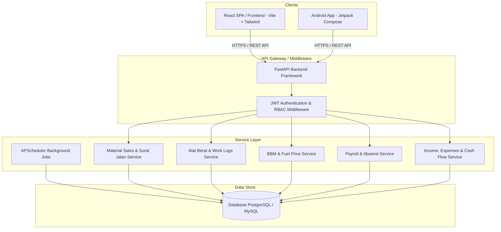
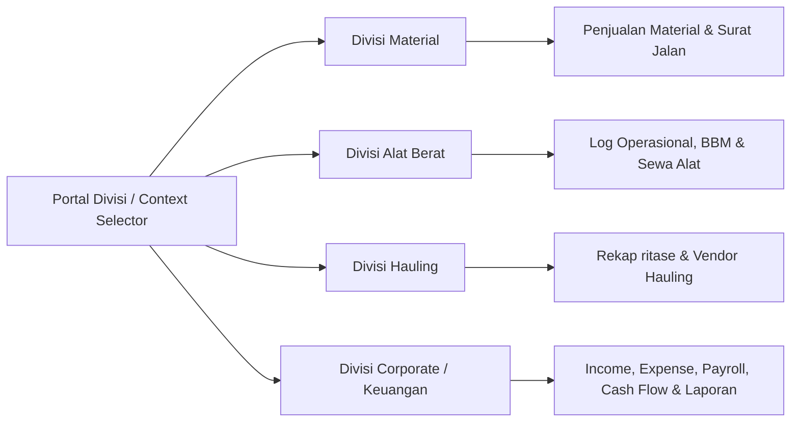
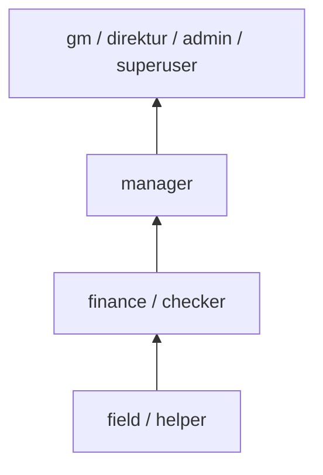
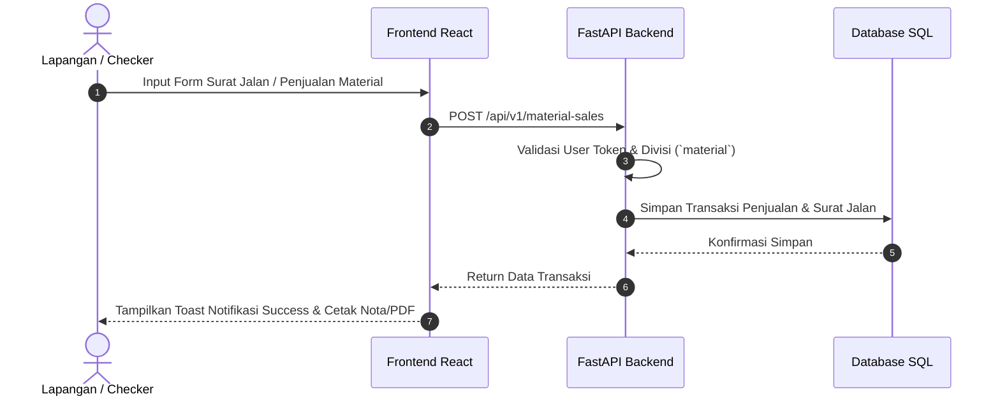
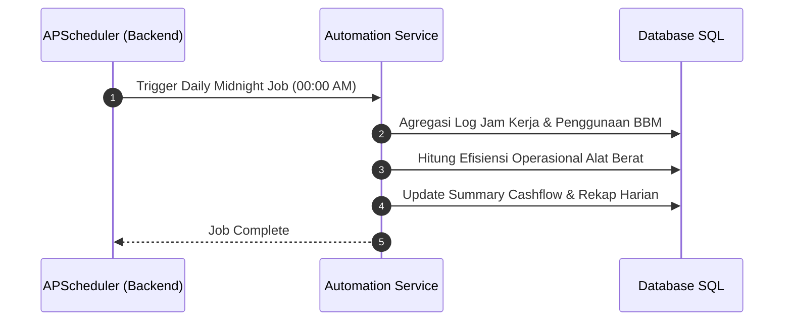

# Architecture Documentation - PT. Kusuma Samudera Berkah

Dokumen ini menjelaskan arsitektur sistem, aliran data (*data flow*), hierarki peran (*role & permission*), serta batas-batas layanan (*service boundaries*) dari platform manajemen terpadu PT. Kusuma Samudera Berkah.

---

## 🏛️ 1. System Overview

Sistem dikembangkan menggunakan pola **Monorepo** yang memfasilitasi integrasi antar komponen web admin, backend REST API, dan aplikasi Android mobile.

---

## 🏢 2. Division-Based Architecture

Sistem ini mendukung pengoperasian berorientasi **Multi-Divisi** untuk mengakomodasi unit bisnis PT. Kusuma Samudera Berkah:

### Detail Divisi & Akses Fitur:
1. **Divisi Material (`material`)**:
   - Transaksi Penjualan Material (Limestone, Dolomite, Boulder, Clay).
   - Pengelolaan Surat Jalan & Tonase/Timbangan.
   - Manajemen Pelanggan & Armada Truk.
2. **Divisi Alat Berat (`alat-berat`)**:
   - Inventaris Alat Berat (Excavator, Buldozer, Loader, dll.).
   - Log Jam Kerja (*Work Logs*), Konsumsi BBM (*Fuel Logs*), dan Maintenance.
   - Vendor Loading & Penetapan Harga Sewa.
3. **Divisi Hauling (`hauling`)**:
   - Pengelolaan Vendor Transporter & Tarif Ritase.
   - Rekap Surat Jalan Pengangkutan.
4. **Divisi Corporate (`corporate`)**:
   - Konsolidasi Finansial: Pemasukan (*Income*), Pengeluaran (*Expense*), dan *Cash Flow*.
   - Penggajian Pegawai (*Payroll*) & Presensi (*Attendance*).
   - Manajemen User & Log Aktivitas Sistem.

---

## 🔐 3. Role & Permission Hierarchy

Sistem menerapkan **Role-Based Access Control (RBAC)** yang ketat yang disesuaikan dengan tingkat wewenang organisasi:

### Matriks Akses Peran:

| Peran (Role) | Ruang Lingkup Akses | Akses Divisi | Hak Akses Utama |
| :--- | :--- | :--- | :--- |
| **`gm` / `direktur` / `admin`** | Full System Access | Semua Divisi | Bebas beralih divisi, CRUD seluruh data, manajemen user, pengesahan laporan. |
| **`manager`** | Operational Supervision | Divisi Tertentu / All | Memantau kinerja operasional, verifikasi transaksi & persetujuan biaya. |
| **`finance`** (termasuk *checker*) | Financial & Reconcile | Corporate, Material, Alat Berat | Input & validasi invoice, harga material/BBM, pembayaran & laporan kas. |
| **`field`** (termasuk *helper*) | Field Data Entry | Material, Alat Berat | Input surat jalan, log BBM, dan log jam kerja di lapangan via Web/Android. |

---

## 🔄 4. Data Flow & Transaction Workflows

### 4.1 Flow Transaksi Penjualan Material & Surat Jalan

### 4.2 Flow Rekapitulasi Kas & Otomatisasi Scheduler

---

## 🛠️ 5. Technology Stack & Boundaries

### Backend Architecture (`/backend`)
- **Framework**: FastAPI (Async Python)
- **ORM**: SQLAlchemy (Declarative Models & Sessions)
- **Authentication**: OAuth2 dengan Password Hashing (Bcrypt) & JWT Bearer Token.
- **Background Tasks**: APScheduler untuk cron job otomatisasi rekap harian & pemeliharaan log.

### Frontend Architecture (`/frontend`)
- **Framework**: React 18 + TypeScript + Vite.
- **State & Data Fetching**: TanStack React Query (Caching, Invalidation, Optimistic Updates).
- **Styling**: Tailwind CSS + Custom CSS Utilities (Glassmorphism & Fluid Typography).
- **Icons & Visuals**: Lucide React + Recharts (Dashboard & Financial Charts).
- **Notification & Modal**: Sonner (Toast System) + Custom Modal Dialogs.

### Mobile Architecture (`/Android`)
- **Framework**: Android Native (Kotlin) dengan Jetpack Compose.
- **API Communication**: Retrofit2 + OkHttp3.

---

**Terakhir Diperbarui:** September 2026  
**Dokumen Pendukung:** [`TECHNICAL_DEBT2.md`]